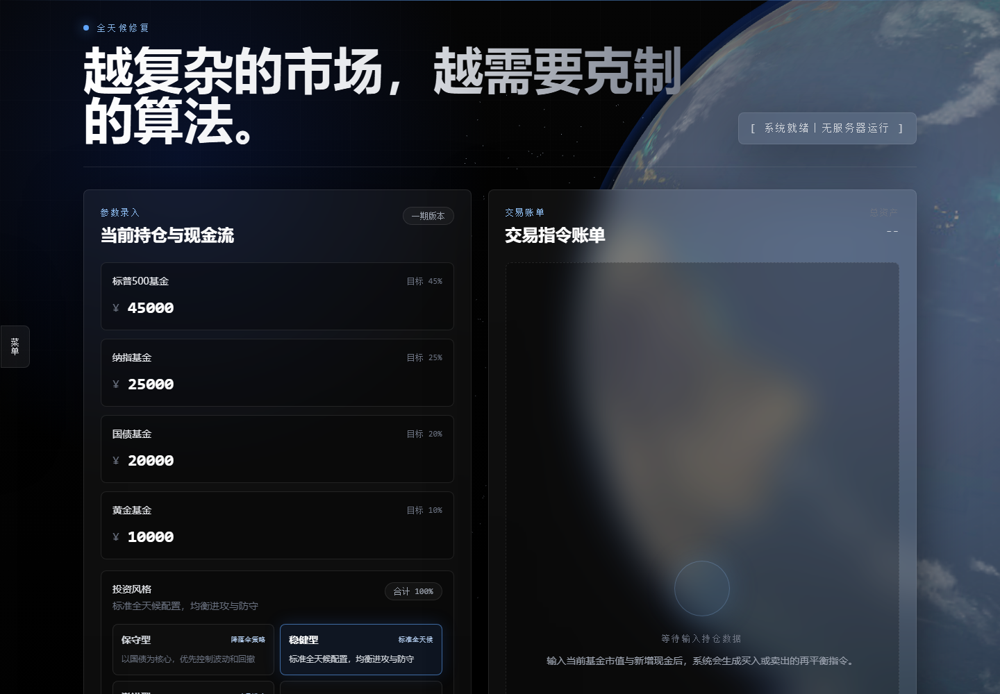

# AllWeather.Fix

AllWeather.Fix 是一个面向长期 ETF 投资者的全球多资产动态再平衡投研平台。项目以「全天候资产配置」为核心思想，结合持仓输入、目标比例、智能补仓、全面再平衡、历史回测、ETF K 线和 AI 策略审查，帮助用户用更克制、更系统的方式管理长期组合。

界面风格：黑色背景、半透明玻璃卡片、真实地球视觉、冷白与钛灰文字，并通过原生 JavaScript 完成主要交互和计算逻辑。



[在线静态 Demo](https://xiaoyecodes.github.io/AllWeather.Fix/) · [GitHub 仓库](https://github.com/XiaoyeCodes/AllWeather.Fix)

> 在线 Demo 由 GitHub Pages 托管，适合预览界面、持仓计算、静态 K 线和本地 JSON 回测。AI 分析、实时市场情报抓取和缺失数据自动补全依赖 `server.js`，需要本地或 Node.js 服务端运行。

> 本项目仅用于投资研究、策略学习和个人资产配置辅助，不构成任何投资建议、收益承诺或交易指令。

## 核心功能

- ETF 组合持仓录入：输入当前各类资产市值和本月新增定投现金。
- 多策略资产比例：内置保守型、稳健型、激进型、自定义四种配置方案。
- 动态再平衡计算：支持「智能补仓，只买不卖」和「全面再平衡，允许卖出」两种模式。
- 历史回测：基于本地历史价格数据计算长期投入、收益曲线、最大回撤等指标。
- ETF K 线：展示 SPY、QQQ、TLT、GLD 等代理 ETF 的 K 线走势。
- AI 策略审查：可配置 OpenAI 兼容接口，结合当前持仓、回测摘要和最新市场情报生成研究报告。
- 中文优先市场情报：后端会抓取东方财富、蛋卷基金、MacroMicro、华尔街见闻等来源，并标记数据新鲜度。

## 默认投资框架

当前默认显示「稳健型」策略：

| 资产 | 代理 ETF | 默认目标比例 | 作用 |
| --- | --- | ---: | --- |
| 标普500基金 | SPY | 45% | 美国大盘核心权益资产 |
| 纳指基金 | QQQ | 25% | 科技成长与高弹性权益资产 |
| 长期国债基金 | TLT | 20% | 利率下行和衰退环境中的防守资产 |
| 黄金基金 | GLD | 10% | 通胀、地缘风险和货币信用风险对冲 |

其他内置策略：

| 策略 | 标普500 | 纳指 | 长期国债 | 黄金 | 风格 |
| --- | ---: | ---: | ---: | ---: | --- |
| 保守型 | 15% | 5% | 65% | 15% | 优先控制波动与回撤 |
| 稳健型 | 45% | 25% | 20% | 10% | 进攻与防守相对均衡 |
| 激进型 | 40% | 50% | 0% | 10% | 提高权益和科技资产弹性 |
| 自定义 | 可调 | 可调 | 可调 | 可调 | 用户自行设定，系统会自动归一化 |

## 投资思路解析

AllWeather.Fix 的核心不是预测短期涨跌，而是把投资决策拆成三个更稳定的问题：

1. 你愿意长期持有什么资产？
2. 每类资产在组合里应该承担什么角色？
3. 当市场波动导致比例偏离目标时，如何用规则把组合拉回纪律区间？

权益资产如 SPY 和 QQQ 负责长期增长，但波动和回撤较大；长期国债在部分经济下行或利率下行阶段可能提供缓冲；黄金则用于对冲通胀、地缘冲突和法币信用风险。多资产组合的目标，是避免组合只依赖单一宏观环境。

再平衡的思想是「卖出相对涨多的资产，买入相对落后的资产」，让组合回到预设风险暴露。对于不想频繁卖出或考虑税费、交易成本的用户，智能补仓模式会只使用新增现金去买入低配资产，尽量纠偏但不卖出老资产。

## 两种再平衡模式

### 智能补仓，只买不卖

适合长期定投、税务敏感或不希望频繁卖出的用户。

算法会把新增现金拆成小步长，迭代分配给当前最偏离目标比例、且明显低配的资产。最终结果只有买入或持有，不会产生卖出指令。

### 全面再平衡，允许卖出

适合希望严格回到目标比例的用户。

算法会计算「当前总市值 + 新增现金」后的目标市值，然后对每类资产计算：

```text
交易金额 = 目标市值 - 当前实际市值
```

正数代表买入，负数代表卖出。

## 如何运行

本项目不依赖 npm 包，后端使用 Node.js 原生模块，前端通过 CDN 加载 Tailwind CSS 和 Three.js。

### 环境要求

- Node.js 18 或更高版本
- Python 3，可选，仅在本地历史数据缺失、需要自动抓取 Yahoo Finance 时使用
- 能访问 CDN 和行情源的网络环境

### 启动服务

在项目根目录运行：

```bash
node server.js
```

看到类似输出后即可访问：

```text
AllWeather.Fix is running at http://localhost:3000
```

浏览器打开：

```text
http://localhost:3000
```

如果想换端口：

```bash
PORT=8080 node server.js
```

在 Windows PowerShell 中可以使用：

```powershell
$env:PORT=8080; node server.js
```

## 打开后会自动加载什么

页面打开后会自动执行：

- 初始化默认策略为「稳健型」
- 初始化再平衡模式为「智能补仓」
- 读取浏览器本地保存的 AI 模型配置
- 自动加载默认 ETF K 线：`SPY` 的 `1mo` 月线
- 渲染持仓输入框、目标比例条和默认界面状态

页面打开后不会自动运行：

- 回测不会自动启动，需要点击「运行回测」
- AI 分析不会自动启动，需要配置模型后点击「生成 AI 建议」
- 再平衡交易账单不会自动计算，需要点击主计算按钮

这样设计是为了避免用户刚打开页面就触发大量网络请求或产生未经确认的分析结果。

## 历史数据与回测数据机制

后端接口：

```text
GET /api/backtest-prices
```

回测数据读取优先级：

1. 优先读取本地文件 `data/backtest-prices.json`
2. 如果本地文件不存在或格式不完整，才尝试调用 `scripts/fetch_yahoo_prices.py`
3. Yahoo 抓取成功后，后端会写回 `data/backtest-prices.json`，下次优先使用本地文件

当前仓库已经包含 `data/backtest-prices.json`，所以点击「运行回测」时通常会直接读取本地数据，不需要重新联网抓取 Yahoo。

回测使用月度 Adjusted Close，资产代理为：

| 资产 | 代理 ETF |
| --- | --- |
| 标普500 | SPY |
| 纳指 | QQQ |
| 长期国债 | TLT |
| 黄金 | GLD |

回测结果会显示：

- 回测区间
- 最终资产
- 累计投入
- 总收益率
- 年化收益率
- 最大回撤
- 收益曲线

## K 线数据机制

后端接口：

```text
GET /api/candles?asset=sp500&timeframe=1mo
```

参数说明：

| 参数 | 可选值 |
| --- | --- |
| asset | `sp500`、`nasdaq`、`bond`、`gold` |
| timeframe | `1d`、`1w`、`1mo`、`1y` |

K 线数据读取优先级：

1. 优先读取 `data/candles/{asset}-{timeframe}.json`
2. 如果本地文件不存在，后端会调用 `scripts/fetch_yahoo_candles.py` 抓取日线数据
3. 后端会按需要聚合为周线、月线或年线
4. 抓取成功后写入本地 JSON，后续访问优先使用本地文件

当前仓库已内置部分常用 K 线数据，例如 SPY 月线、周线、年线，以及 QQQ、TLT、GLD 的月线和年线。若切换到本地未包含的周期，系统会尝试联网补全。

## AI 分析如何使用

AI 分析需要你自己配置模型接口。点击页面左侧隐藏侧边栏的「菜单」，进入「分析模型设置」，填写：

- API 基础地址，例如 `https://api.openai.com/v1`
- 协议类型：Chat Completions 兼容接口或 Responses API
- API Key
- 模型名称

配置会保存在浏览器 `localStorage` 中，不会写入仓库，也不会被 Git 提交。

点击「生成 AI 建议」后，后端会先请求：

```text
GET /api/market-context
```

该接口会抓取中文优先的市场情报，并为每个来源标记：

- 最新：最近 14 天内
- 近期：15-30 天内
- 偏旧或过时：超过 30 天
- 未知日期：无法识别有效日期

随后页面会把以下内容一起发送给模型：

- 当前策略比例
- 当前持仓市值
- 本月新增现金
- 当前再平衡模式
- 最近一次回测摘要
- 市场情报包与数据新鲜度提示

AI 输出应被理解为研究辅助，而不是投资建议。若市场情报缺失、过时或互相矛盾，模型会被要求降低置信度。

## 项目结构

```text
AllWeather.Fix/
├─ index.html                       # 单页面前端
├─ server.js                        # Node.js 静态服务与 API 服务
├─ data/
│  ├─ README.md                     # 本地数据格式说明
│  ├─ backtest-prices.json          # 本地回测月度价格数据
│  ├─ backtest-prices.template.json
│  └─ candles/                      # ETF K 线数据
├─ scripts/
│  ├─ fetch_yahoo_prices.py         # Yahoo 月度价格抓取脚本
│  └─ fetch_yahoo_candles.py        # Yahoo 日线 K 线抓取脚本
└─ README.md
```

## 部署说明

### 本地或 Node.js 平台

完整功能需要运行 `server.js`，因为回测数据、K 线补全、市场情报抓取和 AI 分析都依赖后端 API。

适合部署到：

- 本地电脑
- VPS
- Railway
- Render
- Fly.io
- 其他支持 Node.js HTTP 服务的平台

启动命令：

```bash
node server.js
```

### Cloudflare Pages

如果只把 `index.html` 当作静态文件部署到 Cloudflare Pages，页面视觉可以打开，但以下后端功能不会完整可用：

- `/api/backtest-prices`
- `/api/candles`
- `/api/market-context`
- `/api/ai-analysis`

要在 Cloudflare Pages 上保留完整功能，需要把 `server.js` 中的 API 逻辑改造成 Cloudflare Pages Functions 或 Cloudflare Workers。当前仓库版本以 Node.js 服务运行方式为准。

### GitHub Pages Demo

仓库包含 GitHub Pages 自动部署 workflow。推送到 `main` 后，GitHub Actions 会发布一个静态演示站点：

```text
https://xiaoyecodes.github.io/AllWeather.Fix/
```

静态 Demo 支持：

- 页面视觉预览
- 持仓输入与再平衡计算
- 仓库内置 JSON 的 ETF K 线展示
- 仓库内置 JSON 的历史回测

静态 Demo 不支持：

- 后端实时抓取市场情报
- AI 分析代理接口
- 本地缺失数据自动写回
- 通过 `server.js` 动态补全 Yahoo 数据

## 数据与模型限制

- 回测使用 ETF 代理数据，不等于真实基金或账户收益。
- 历史数据不包含税费、佣金、滑点、汇率、申赎成本和现金利息。
- TLT、GLD 等 ETF 的成立时间限制会影响可回测共同区间。
- Yahoo Finance 和网页情报源可能临时不可达、字段变化或被网络环境影响。
- AI 分析依赖用户配置的模型能力、市场情报抓取质量和 prompt 约束，不能保证准确。
- 宏观周期、估值水平和券商观点会快速变化，过时数据可能导致判断失真。

## 风险提示

本项目不是投顾服务，不提供任何确定性收益承诺。资产配置和再平衡只能帮助用户建立纪律框架，不能消除市场风险。

使用本项目时，请特别注意：

- 股票资产可能出现长期下跌或高波动。
- 长期国债在加息和通胀环境中可能出现较大回撤。
- 黄金可能长期横盘，也可能受美元、实际利率和地缘风险影响剧烈波动。
- 再平衡可能在趋势行情中降低短期收益，也可能在极端行情中无法避免损失。
- AI 生成内容可能遗漏重要事实、误读数据或给出不适合个人情况的建议。

任何买卖决策都应结合个人风险承受能力、投资期限、现金流、税务情况和专业顾问意见独立判断。

## License

请参考仓库中的 `LICENSE` 文件。
